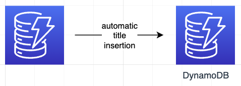

# draw.io automated AWS icon title insertion

I use draw.io a lot, and I discovered that it is convenient to have the many AWS icons not only visible by their logos, but also having the titles, service names like "DynamoDB" visible underneath the icon.



To avoid the manual title insertion of all AWS icons, I have created a Python script that finds all AWS icons in a draw.io file which do not yet have a title, and it will insert the official title like e.g. "CloudFormation".

Prerequisite: 

* So far, I only tested this on MacOS and there it works well! Please file an issue if you find the script not working on Windows or Linux.
* For the script to work, you need to make sure that draw.io is storing the diagrams in uncompressed XML files.
* To switch off compression in your draw.io desktop app, go to Extras > Configuration
* Then enter this into the text box:
```
{
  "compressXml": false
}
```

Whenever the script detects a missing AWS icon, it will insert the missing default title in the draw.io XML file. In that moment, draw.io will detect that its XML file was changed externally, and you will see a red box in the top menu list saying "The file has been modified. Click here to synchronize". If you confirm that, the inserted icon title will show up!


Please be aware that the script runs like a permanent observer, i.e. it performs an infinite loop and checks the draw.io file each 2 seconds (adjustable with variable "sleepTime").

One convenient way to invoke the script on MacOS would be to send it to the background plus send all output to /dev/null to get rid of any repetitive terminal messages:

python drawio-updater.py <draw.io-filename> > /dev/null 2>&1 &

You can pull it to the foreground again by typing "fg". Then stop it by pressing CTRL+c.

Hope you find it useful!
